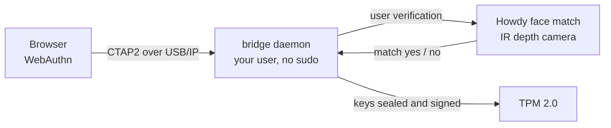

# howdy-as-passkey

Use [Howdy](https://github.com/boltgolt/howdy) face authentication as a **passkey** (WebAuthn/FIDO2) that browsers and apps recognize.

Linux has no native platform authenticator, the role Windows Hello and macOS Touch ID fill. This bridges the gap: a virtual FIDO2/CTAP2 authenticator whose user verification step is your Howdy face match.

> **Status:** working. Verified in Chrome on [webauthn.io](https://webauthn.io) and GitHub, doing passkey registration and sign-in with `uv=1`, gated by a live Howdy scan, with no sudo at runtime. On a machine with a TPM the vault key is sealed to it (auto-detected). This is a personal-use project and is **not security audited** (see [Security](#security)).

## How it works



The browser runs a normal WebAuthn ceremony and sees a standard USB security key. When it asks for user verification, the daemon runs a Howdy face check (`pamtester howdy-only`). On a match it signs the assertion, inside the TPM when one is present. It fails closed on any error. See [docs/security.md](docs/security.md) for the full trust model, the verification ceremony, and key handling, with diagrams.

## Quickstart (Arch / CachyOS)

```sh
git clone https://github.com/NicklasKleemann/howdy-as-passkey
cd howdy-as-passkey

./scripts/setup-env.sh        # deps, howdy-only PAM stack, usbip group + udev rule, vhci module
./scripts/install-service.sh  # build, install to ~/.local/bin, set up the systemd user service
                              # (it prompts for a vault passphrase; remember it, it encrypts your keys)
# log out and back in once so the 'usbip' group takes effect, then:
systemctl --user start howdy-passkey-bridge.service
```

Then register a passkey on any site. In the browser dialog pick the **security key / USB** option (we present over USB transport), and Howdy prompts for your face. The service autostarts on every login thereafter.

Manage it:

```sh
systemctl --user status howdy-passkey-bridge      # is it running?
journalctl --user -u howdy-passkey-bridge -f      # live logs (CTAP traffic, Howdy prompts)
systemctl --user stop howdy-passkey-bridge        # stop
```

Other distros: install the equivalents of the packages listed in `scripts/setup-env.sh`, which is written for Arch/pacman.

## Prerequisites

You bring these; the setup script does not install them for you:

- **Howdy**, installed and enrolled (`sudo howdy add`). The install is distro specific (see [howdy](https://github.com/boltgolt/howdy)).
- **An IR depth camera.** RGB-only webcams are photo/screen-spoofable; do not trust this for real accounts without IR liveness.
- **TPM 2.0** (optional). If present, `install-service.sh` seals the vault key to it and the bridge auto-detects it at startup; otherwise the vault uses passphrase encryption on disk. See [docs/security.md](docs/security.md).
- Linux with the `vhci-hcd` kernel module available (mainline; loaded by setup).

## Testing

```sh
. scripts/env.sh
( cd src/virtual-fido && go test ./ctap/ ./cmd/howdy-bridge/ )   # unit tests, no hardware
```

The unit tests cover the fork's CTAP changes (the UV flag on makeCredential and getAssertion, GetInfo advertising uv and platform, graceful errors instead of panics) and the approver (fail-closed PAM logic, action routing, vault round-trip). They use a mocked PAM call, so no camera is needed.

The end-to-end test needs the IR camera, an enrolled face, and the `usbip` group active, and it performs a live scan:

```sh
sg usbip -c scripts/test-e2e.sh
```

It attaches the authenticator, drives a real `makeCredential` with libfido2, asserts `uv=1`, and verifies the result.

## Security

Read [docs/security.md](docs/security.md) before trusting this with real accounts. In short: it is built for personal use on a machine with an IR depth camera. It runs unprivileged (no sudo), and the only security gate is the Howdy face check, which fails closed. On a machine with a TPM the vault key is sealed to it, so the vault cannot be decrypted on another machine; without a TPM the vault is passphrase-encrypted on disk. Clearing or replacing the TPM loses the vault, so keep the pre-TPM backup the migration writes (`vault.json.pre-tpm.bak`). It is **not hardware attested and not security reviewed.** Keep a second 2FA method on any account you add it to.

## What the fork changes

This forks `bulwarkid/virtual-fido` and patches it for Howdy-gated, TPM-backed passkeys:

- **User verification:** sets the WebAuthn UV flag when a ceremony is approved by a Howdy face match (upstream set it only under CTAP PIN auth), and advertises `uv` in GetInfo. Relying parties that require `uv=1` now accept the credential.
- **Platform authenticator:** presents as a platform authenticator so browsers route the passkey path to it.
- **TPM:** the vault key is sealed to the TPM, and on a TPM machine credential keys are generated and signed inside the chip, so the private key never leaves it. Without a TPM the keys stay software-backed and the vault uses passphrase encryption.
- **Robustness:** returns CTAP spec errors instead of panicking on empty or unknown commands. A dropped USB/IP connection (a manual detach, or suspend/resume tearing down the link) ends the handler cleanly and frees the vhci port, rather than spinning on the dead socket as upstream did.
- **Stays attached:** the daemon attaches the virtual device once at startup, then watches it. If the device drops (suspend/resume is the common case) it re-attaches automatically within a few seconds, so the passkey is back without restarting the service.
- **Unprivileged:** runs with no sudo. A `usbip` group plus a udev rule grant the vhci attach, and the `tss` group grants TPM access.

## Built on

- [bulwarkid/virtual-fido](https://github.com/bulwarkid/virtual-fido), the CTAP2/U2F and USB/IP authenticator this forks and patches (MIT; license preserved at `src/virtual-fido/LICENSE`). See [What the fork changes](#what-the-fork-changes).
- [Howdy](https://github.com/boltgolt/howdy), the face-recognition PAM module that provides user verification.

## License

MIT. See [LICENSE](LICENSE). The bundled `src/virtual-fido/` keeps its own MIT license (© 2022 BulwarkID).
