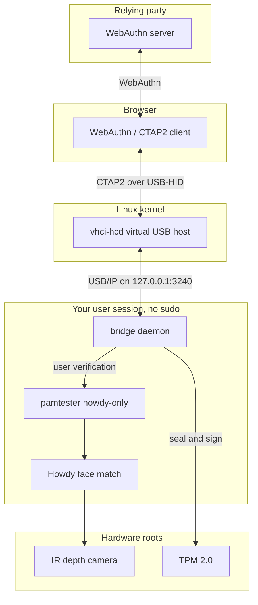
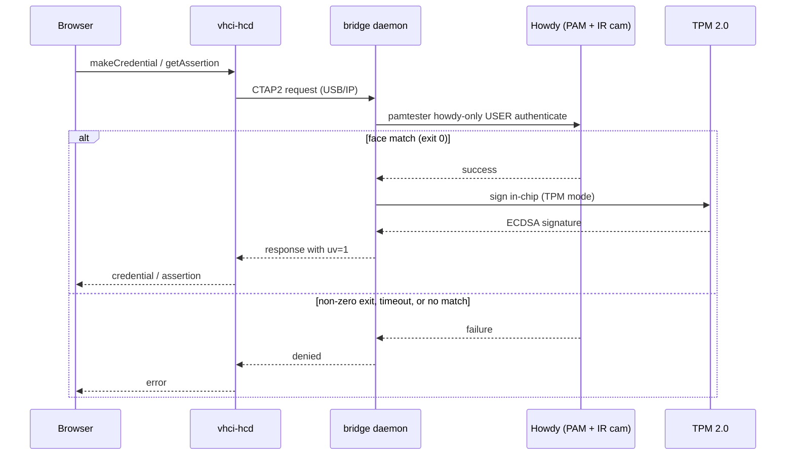
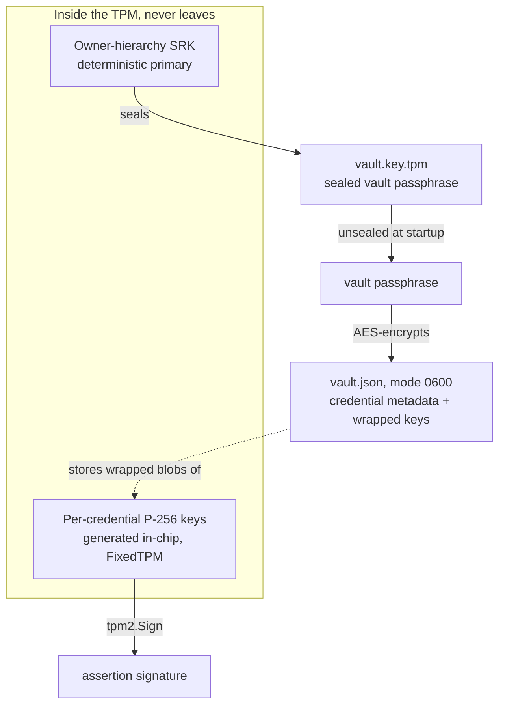

# Security model

This is homemade authenticator software. Read it before trusting it with real
accounts. The short version: it is built for personal use on a machine with an
IR depth camera and a TPM, it runs unprivileged, and its only verification gate
is a live Howdy face match that fails closed. It is not hardware-attested and
not security-reviewed.

## Architecture and trust boundaries

The bridge is a userspace daemon that presents a virtual FIDO2/CTAP2
authenticator to the browser over USB/IP, gates every ceremony on a Howdy face
match, and (on a TPM machine) keeps key material inside the chip.

Boundaries that matter:

- **Network exposure is loopback only.** The USB/IP server binds `127.0.0.1:3240`
  and refuses any connection whose remote address is not local. The browser
  reaches it through the kernel's `vhci-hcd`, not over the network.
- **No privileged process.** Every component above runs as your user. The only
  operation that would normally need root, writing the vhci `attach`/`detach`
  sysfs controls, is delegated to a `usbip` group via a udev rule. TPM access is
  delegated to the `tss` group. There is no sudoers entry and no setuid binary.
- **The camera path is not protected.** Howdy and its model run in userspace with
  no secure enclave between the camera and the daemon. Liveness comes from the IR
  depth sensor, not from a trusted hardware path.

## The verification ceremony

Every WebAuthn ceremony (and the U2F equivalents) routes through a single
approval hook, `ApproveClientAction`, which runs a fresh Howdy check. Nothing is
cached: a "yes" is only ever the result of a match that just happened.

Properties this enforces:

- **UV honesty.** The WebAuthn user-verification (`uv`) bit is asserted only on a
  real, current match. The daemon advertises `uv` in `GetInfo`, so relying
  parties that require `uv=1` accept the credential, and that bit is never set
  without a Howdy success.
- **Fail closed.** `verify()` returns true only on a clean PAM success. Any other
  outcome (non-zero exit, missing `pamtester`, or the 30-second timeout backstop)
  denies. A wedged check denies rather than hanging as "approval pending".
- **One gate per ceremony.** `makeCredential`, `getAssertion`, and the two U2F
  actions each call the same check. An unknown action type is denied by default.

## Key protection and data at rest

There are two layers of key protection, and on a TPM machine both are anchored in
the chip.

**Layer 1: the vault.** Credentials live in `vault.json` (mode `0600`), encrypted
with AES under a key derived from a vault passphrase. The file is useless without
that passphrase.

**Layer 2: where the passphrase comes from.** The bridge auto-detects its mode at
startup from the presence of `vault.key.tpm`:

- **TPM mode.** A 32-byte random passphrase is sealed to the TPM under a
  deterministic owner-hierarchy primary (an ECC SRK that is recreated from the
  TPM's owner seed each boot, so it is never persisted). The sealed object is
  marked `FixedTPM` and `FixedParent`, so the blob on disk can only be unsealed by
  this exact TPM. The passphrase never exists in plaintext on disk.
- **Disk mode.** With no sealed key, the vault falls back to a passphrase supplied
  by `HOWDY_BRIDGE_PASSPHRASE` or `--passphrase`, encrypting the vault on disk with
  no hardware binding.

**In-chip credential keys (TPM mode).** Beyond sealing the vault, each passkey's
signing key is generated *inside* the TPM as a P-256 key with `SensitiveDataOrigin`
and `FixedTPM` set, so the private half never exists outside the chip. The vault
stores only the TPM-wrapped blob. Signing loads that blob and calls `tpm2.Sign`,
so even a fully decrypted vault yields no usable private keys off this TPM. In
disk mode the keys are software-backed instead.

**Migration is crash-safe.** `--tpm-init` is ordered so a failure never leaves the
vault unreadable: it verifies the current vault decrypts, seals and verify-unseals
the new key before trusting it, backs up the old vault to `vault.json.pre-tpm.bak`,
writes the sealed key, then re-encrypts the vault atomically. Clearing or replacing
the TPM loses the sealed key, so that backup is the recovery path.

## Threat model and comparison to Windows Hello

Windows Hello has two layers, a biometric and a TPM key-binding. This project
copies both:

| Layer | Windows Hello | This project |
|---|---|---|
| Biometric | face/fingerprint | Howdy + **IR depth camera** |
| Key binding | keys in TPM | keys generated and signed in **TPM 2.0** |

Hello's documented bypasses (spoofed USB cameras, CVE-2021-34466; fingerprint
defeats) target the biometric layer, not the TPM key-binding. This project
matches both for personal use.

### What protects you

1. **IR liveness.** An IR depth camera defeats the photo and screen spoofing that
   fools RGB face auth.
2. **TPM-bound keys (when present).** The vault passphrase is sealed to the TPM and
   credential private keys are generated and signed in-chip, so neither the vault
   nor the keys are usable on another machine.
3. **Fail closed.** Any Howdy error or timeout denies, and `uv` is never asserted
   without a real match.

### What this is NOT

- **Not hardware-attested.** Howdy's model runs in userspace with no secure enclave
  guarding the camera path, and the authenticator reports no hardware attestation.
  Its security is not hardware-backed at the biometric layer.
- **Not security-reviewed.** A personal-use tool, not suitable as authentication
  for other people without a real review.
- **Not boot-state-bound.** Sealing binds the vault key to the TPM, not to a
  measured boot state. A PCR-bound sealing policy is not yet implemented, so the
  blob unseals on this TPM regardless of what booted.
- **Root is game over.** An attacker with root can rewrite the PAM stack or the
  daemon and ask the TPM to sign. TPM sealing defends data at rest and offline
  theft, not a live rooted box.

## Design rules

- **UV honesty.** When the daemon asserts user-verification to a relying party,
  that assertion reflects a real, current Howdy match, with no cached "yes". Each
  ceremony runs `pamtester howdy-only <user> authenticate` and fails closed on any
  non-success.
- **Least privilege.** The daemon runs fully unprivileged. Howdy auth works as the
  user (member of `video`); the vhci sysfs writes are granted through a dedicated
  `usbip` group and a udev rule (`scripts/70-howdy-passkey-vhci.rules`); TPM access
  is granted through the `tss` group. There is no sudoers entry.
  - Residual risk: members of the `usbip` group can attach and detach USB/IP
    devices (for example a rogue HID), so the group should hold only the human
    user(s) who run the bridge. This is strictly better than the rejected
    alternative, a NOPASSWD sudo rule for `usbip attach *`, whose wildcard let any
    local code attach an arbitrary remote device as root.
- **Robustness.** Unknown or empty CTAP commands return a spec error rather than
  panicking, and a dropped USB/IP connection ends the handler cleanly instead of
  spinning, so a single malformed frame or a detach from any process on the bus
  cannot crash the authenticator.
- **Enrollment coverage.** Howdy is appearance-sensitive, so a sample for each
  regular look (for example with and without glasses) avoids false rejections.

## Attestation

The authenticator uses an ephemeral self-signed attestation CA, regenerated on
every run. This is fine for a platform authenticator using packed/self
attestation, and it is deliberately not a stable identity. Under the browser
default (`attestation=none`) the AAGUID is reported as all zeros; a real AAGUID
would only appear under `attestation=direct`.

## Why NOT TPM-seal sudo

TPM secures *keys*; biometrics produce a *decision* (yes/no). `sudo` auth is a
boolean PAM gate with no key to release, so there is nothing for the TPM to hold
or unlock there. Sealing helps only where a decision releases a key (this bridge;
LUKS unlock), so `sudo` stays plain PAM-Howdy.
